# SDLC Framework Documentation

## Overview

The Autonomous SDLC Framework for Continual Tiny Transformer is a comprehensive, production-ready system that automates the entire Software Development Life Cycle with intelligent optimization, robust error recovery, and enterprise-grade security.

## Architecture

### Core Components

```mermaid
graph TB
    A[SDLC Orchestrator] --> B[Workflow Engine]
    A --> C[Automation System]
    A --> D[Monitoring & Metrics]
    A --> E[Reliability Manager]
    A --> F[Security Validator]
    A --> G[Optimization Engine]
    
    B --> H[Task Execution]
    B --> I[Dependency Resolution]
    
    C --> J[File Watchers]
    C --> K[Schedulers]
    C --> L[Task Runners]
    
    D --> M[System Health]
    D --> N[Performance Metrics]
    D --> O[Failure Analysis]
    
    E --> P[Circuit Breakers]
    E --> Q[Health Checkers]
    E --> R[Recovery Strategies]
    
    F --> S[Secret Scanning]
    F --> T[Dependency Analysis]
    F --> U[Code Security]
    
    G --> V[Resource Monitoring]
    G --> W[Task Profiling]
    G --> X[Intelligent Scheduling]
```



### Framework Layers

1. **Orchestration Layer**: Central coordination and management
2. **Automation Layer**: Workflow execution and task management
3. **Intelligence Layer**: Optimization and adaptive behavior
4. **Reliability Layer**: Error handling and system resilience
5. **Security Layer**: Comprehensive security scanning and validation
6. **Monitoring Layer**: Real-time metrics and system health

## Key Features

### 🚀 Progressive Enhancement

The framework implements three generations of sophistication:

- **Generation 1 (Simple)**: Basic workflow execution and task management
- **Generation 2 (Reliable)**: Advanced error handling, monitoring, and recovery
- **Generation 3 (Optimized)**: Intelligent scheduling, resource optimization, and scaling

### 🧠 Intelligent Optimization

- **Resource-Aware Scheduling**: Dynamically allocates tasks based on CPU, memory, and I/O patterns
- **Adaptive Parallelization**: Automatically determines optimal concurrency levels
- **Performance Profiling**: Learns from execution history to optimize future runs
- **Predictive Scaling**: Anticipates resource needs and scales accordingly

### 🛡️ Enterprise Security

- **Multi-Level Scanning**: Basic to paranoid security levels
- **Secret Detection**: Identifies hardcoded credentials and sensitive data
- **Dependency Analysis**: Scans for vulnerable packages and libraries
- **Code Security**: Static analysis for security vulnerabilities
- **Compliance**: GDPR, CCPA, and enterprise security standards

### 🔄 Autonomous Recovery

- **Circuit Breakers**: Prevent cascading failures
- **Pattern Recognition**: Learns from failures to improve recovery
- **Health Monitoring**: Continuous system health assessment
- **Self-Healing**: Automatic recovery from common failure scenarios

## Quick Start

### Installation

```bash
# Install the SDLC framework
pip install -e .

# Install development dependencies
pip install -e ".[dev,test,docs]"
```

### Basic Usage

```python
from continual_transformer.sdlc.core import SDLCManager, WorkflowTask, TaskPriority

# Initialize SDLC manager
manager = SDLCManager("/path/to/project")

# Create workflow tasks
tasks = [
    WorkflowTask(
        id="build",
        name="Build Application",
        command="make build",
        description="Build the application",
        priority=TaskPriority.HIGH
    ),
    WorkflowTask(
        id="test",
        name="Run Tests",
        command="make test-coverage",
        description="Run comprehensive tests",
        dependencies=["build"],
        priority=TaskPriority.CRITICAL
    )
]

# Create and execute workflow
workflow_id = manager.create_workflow("ci_pipeline", tasks)
results = manager.execute_workflow(workflow_id)

# Check results
for task_id, result in results.items():
    print(f"Task {task_id}: {result.status}")
```

### Automated Workflows

```python
from continual_transformer.sdlc.automation import AutomatedWorkflow, AutomationConfig, TriggerType

# Configure automation
config = AutomationConfig(
    level="fully_auto",
    triggers=[TriggerType.FILE_CHANGE, TriggerType.SCHEDULE],
    max_concurrent=4
)

# Initialize automated workflow
workflow = AutomatedWorkflow("/path/to/project", config)
workflow.start()

# Create and execute CI pipeline
ci_workflow_id = workflow.create_ci_workflow()
execution_id = workflow.execute_workflow(ci_workflow_id)
```

### Security Scanning

```bash
# Run security scan with strict validation
python scripts/security_scanner.py . --level strict --output security_report.json

# Run automated security scanning in CI
python scripts/security_scanner.py . --level paranoid --fail-on-high --report detailed_security.json
```

### Production Deployment

```bash
# Deploy complete infrastructure and application
./deployment/scripts/deploy.sh all --environment production

# Deploy only infrastructure
./deployment/scripts/deploy.sh infrastructure --region us-west-2

# Deploy only application
./deployment/scripts/deploy.sh application --tag v1.2.3
```

## Configuration

### Environment Variables

```bash
# Core settings
SDLC_HOME=/path/to/project
SDLC_LOG_LEVEL=INFO
SDLC_MAX_WORKERS=4

# Security settings
SDLC_SECURITY_LEVEL=standard
SDLC_FAIL_ON_CRITICAL=true
SDLC_FAIL_ON_HIGH=false

# Monitoring settings
SDLC_MONITORING_INTERVAL=60
SDLC_ALERT_THRESHOLD_CPU=80
SDLC_ALERT_THRESHOLD_MEMORY=85

# Optimization settings
SDLC_OPTIMIZATION_STRATEGY=intelligent
SDLC_RESOURCE_MONITORING=true
```

### Configuration Files

#### automation_config.yml

```yaml
automation_level: "fully_auto"
triggers: ["file_change", "schedule", "api_call"]
max_concurrent: 8
retry_failed: true
monitoring_interval: 30
security_level: "strict"
optimization_strategy: "intelligent"
```

#### security_policy.yml

```yaml
security_levels:
  basic:
    scan_secrets: true
    scan_dependencies: false
    fail_on_critical: true
    fail_on_high: false
  
  strict:
    scan_secrets: true
    scan_dependencies: true
    scan_code: true
    fail_on_critical: true
    fail_on_high: true
    additional_checks: true
```

## API Reference

### Core Classes

#### SDLCManager

Central orchestrator for SDLC operations.

```python
class SDLCManager:
    def __init__(self, project_path: str, config: Optional[Dict] = None)
    def create_workflow(self, name: str, tasks: List[WorkflowTask]) -> str
    def execute_workflow(self, workflow_id: str) -> Dict[str, WorkflowResult]
    def get_workflow_status(self, workflow_id: str) -> Dict[str, Any]
```

#### WorkflowTask

Represents a single task in a workflow.

```python
@dataclass
class WorkflowTask:
    id: str
    name: str
    command: str
    description: str
    dependencies: List[str] = None
    priority: TaskPriority = TaskPriority.NORMAL
    timeout: int = 300
    retry_count: int = 3
    environment: Dict[str, str] = None
```

#### AutomatedWorkflow

Automated workflow execution system.

```python
class AutomatedWorkflow:
    def __init__(self, project_path: str, config: AutomationConfig = None)
    def start(self)
    def stop(self)
    def create_ci_workflow(self) -> str
    def create_deployment_workflow(self) -> str
    def execute_workflow(self, workflow_id: str, trigger: TriggerType) -> str
```

### Security Classes

#### SecurityValidator

Comprehensive security scanning and validation.

```python
class SecurityValidator:
    def __init__(self, project_path: str, security_level: SecurityLevel)
    def run_comprehensive_scan(self) -> SecurityScanResult
    def validate_scan_result(self, result: SecurityScanResult) -> Tuple[bool, str]
    def generate_security_report(self, result: SecurityScanResult, output_path: str)
```

### Optimization Classes

#### OptimizedWorkflowEngine

Intelligent workflow optimization and execution.

```python
class OptimizedWorkflowEngine:
    def __init__(self, max_workers: int = None, optimization_strategy: OptimizationStrategy)
    def execute_optimized_workflow(self, tasks: List[WorkflowTask]) -> Dict[str, WorkflowResult]
    def get_performance_metrics(self) -> Dict[str, Any]
```

## Advanced Usage

### Custom Task Types

```python
class CustomMLTask(WorkflowTask):
    def __init__(self, model_config: Dict[str, Any], **kwargs):
        super().__init__(**kwargs)
        self.model_config = model_config
        self.environment = {**self.environment, **{
            'MODEL_CONFIG': json.dumps(model_config),
            'CUDA_VISIBLE_DEVICES': '0'
        }}
```

### Custom Recovery Strategies

```python
from continual_transformer.sdlc.reliability import FailurePattern, RecoveryStrategy, FailureMode

custom_pattern = FailurePattern(
    failure_mode=FailureMode.CUSTOM,
    error_patterns=["custom error pattern"],
    exit_codes=[42],
    recovery_strategy=RecoveryStrategy.FALLBACK_COMMAND,
    fallback_command="python scripts/recovery.py"
)

reliability_manager.failure_patterns.append(custom_pattern)
```

### Performance Monitoring Integration

```python
from continual_transformer.sdlc.monitoring import SDLCMonitor

monitor = SDLCMonitor(project_path)
monitor.start_monitoring(interval_seconds=30)

# Get comprehensive metrics
dashboard_data = monitor.get_dashboard_data()
print(f"System health: {dashboard_data['system_status']}")
```

## Production Deployment

### Infrastructure Requirements

- **Minimum Resources**: 4 CPU cores, 8GB RAM, 50GB storage
- **Recommended Resources**: 8 CPU cores, 16GB RAM, 100GB SSD
- **Network**: High-speed internet for dependency downloads
- **Operating System**: Linux (Ubuntu 20.04+ recommended)

### Kubernetes Deployment

```bash
# Apply Kubernetes manifests
kubectl apply -f deployment/kubernetes/sdlc-deployment.yaml

# Check deployment status
kubectl get pods -n continual-transformer-sdlc
kubectl get services -n continual-transformer-sdlc

# View logs
kubectl logs -f deployment/sdlc-automation -n continual-transformer-sdlc
```

### Monitoring and Alerting

#### Health Checks

- **Liveness Probe**: Ensures container is running
- **Readiness Probe**: Ensures container is ready to serve traffic
- **Startup Probe**: Ensures container starts successfully

#### Metrics Collection

- **System Metrics**: CPU, memory, disk usage
- **Application Metrics**: Task success rates, execution times
- **Security Metrics**: Vulnerability counts, scan frequencies

#### Alert Configuration

```yaml
alerts:
  high_failure_rate:
    condition: "failure_rate > 20%"
    severity: critical
    
  high_resource_usage:
    condition: "cpu_usage > 80% OR memory_usage > 85%"
    severity: warning
    
  security_vulnerability:
    condition: "critical_vulnerabilities > 0"
    severity: critical
```

## Troubleshooting

### Common Issues

#### Task Execution Failures

```bash
# Check task logs
kubectl logs -f deployment/sdlc-automation -n continual-transformer-sdlc

# Check system resources
kubectl top pods -n continual-transformer-sdlc

# Verify configuration
kubectl get configmap sdlc-config -n continual-transformer-sdlc -o yaml
```

#### Security Scan Issues

```bash
# Run security scan with debug logging
python scripts/security_scanner.py . --level standard --log-level DEBUG

# Check for missing security tools
which bandit safety pip-audit

# Verify file permissions
ls -la src/ tests/
```

#### Performance Issues

```bash
# Check resource usage
kubectl top pods -n continual-transformer-sdlc

# Review performance metrics
python scripts/sdlc_automation.py . status --output system_status.json

# Analyze task profiling data
cat logs/sdlc_automation.log | grep "Task.*completed"
```

### Debug Mode

```bash
# Enable debug logging
export SDLC_LOG_LEVEL=DEBUG

# Run with verbose output
python scripts/sdlc_automation.py . ci --log-level DEBUG

# Collect diagnostic information
kubectl describe pod -l app=sdlc-automation -n continual-transformer-sdlc
```

## Best Practices

### Task Design

1. **Atomic Tasks**: Keep tasks focused on single responsibilities
2. **Idempotent Operations**: Ensure tasks can be run multiple times safely
3. **Proper Dependencies**: Define clear task dependencies
4. **Timeout Management**: Set appropriate timeouts for tasks
5. **Error Handling**: Include proper error messages and recovery hints

### Security

1. **Regular Scans**: Run security scans on every commit
2. **Secret Management**: Use proper secret management systems
3. **Least Privilege**: Run with minimal required permissions
4. **Regular Updates**: Keep dependencies updated
5. **Audit Logs**: Maintain comprehensive audit trails

### Performance

1. **Resource Monitoring**: Monitor system resources continuously
2. **Task Profiling**: Analyze task performance patterns
3. **Optimization**: Use intelligent optimization strategies
4. **Scaling**: Configure appropriate scaling policies
5. **Caching**: Implement caching where appropriate

### Monitoring

1. **Health Checks**: Implement comprehensive health checks
2. **Metrics Collection**: Collect relevant metrics
3. **Alert Configuration**: Set up appropriate alerts
4. **Log Management**: Implement structured logging
5. **Dashboard**: Create monitoring dashboards

## Contributing

### Development Setup

```bash
# Clone repository
git clone https://github.com/your-org/continual-tiny-transformer.git
cd continual-tiny-transformer

# Create virtual environment
python -m venv venv
source venv/bin/activate  # On Windows: venv\Scripts\activate

# Install development dependencies
pip install -e ".[dev,test,docs]"

# Install pre-commit hooks
pre-commit install
```

### Running Tests

```bash
# Run all tests
make test

# Run specific test categories
make test-unit
make test-integration
make test-benchmarks

# Run with coverage
make test-coverage
```

### Code Quality

```bash
# Run linting
make lint

# Auto-format code
make format

# Type checking
make type-check

# Security checks
make security

# Run complete CI pipeline
make ci
```

### Documentation

```bash
# Build documentation
make docs

# Serve documentation locally
make docs-serve

# Clean documentation build
make docs-clean
```

## License

This project is licensed under the MIT License - see the [LICENSE](../LICENSE) file for details.

## Support

For support and questions:

1. Check the [troubleshooting section](#troubleshooting)
2. Search existing [GitHub issues](https://github.com/your-org/continual-tiny-transformer/issues)
3. Create a new issue with detailed information
4. Contact the development team

## Roadmap

### Upcoming Features

- [ ] Multi-cloud deployment support
- [ ] Advanced ML pipeline optimization
- [ ] Real-time collaboration features
- [ ] Enhanced security scanning
- [ ] Improved monitoring dashboards
- [ ] API-first architecture
- [ ] Plugin system for extensibility

### Version History

- **v1.0.0**: Initial release with core SDLC functionality
- **v1.1.0**: Added intelligent optimization and security scanning
- **v1.2.0**: Production deployment and Kubernetes support
- **v1.3.0**: Advanced monitoring and reliability features